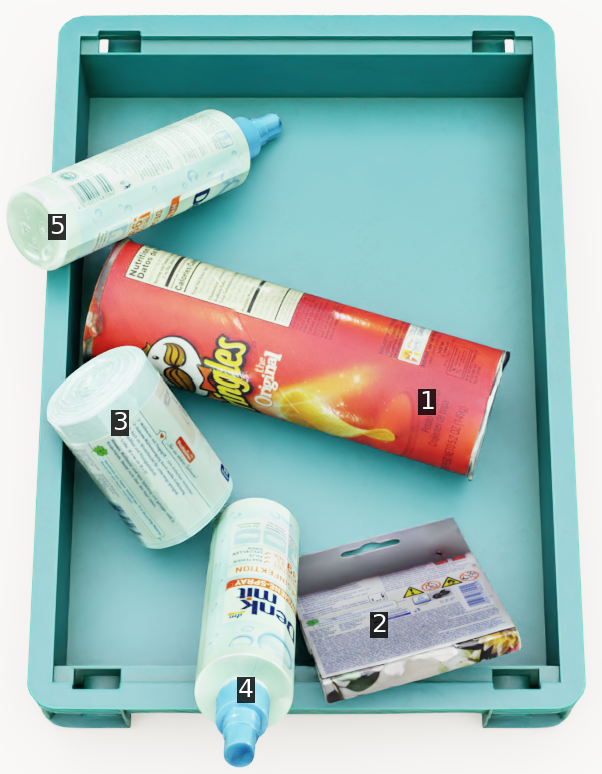
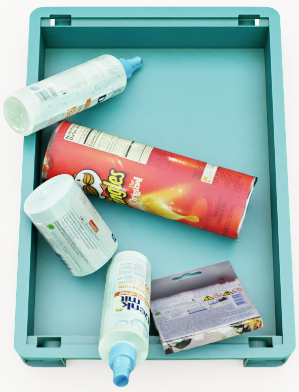

# UnoBench Challenge

This branch provides a **minimal runnable starter kit** for the **UnoBench Challenge**. It contains small example query files, sample images, sample predictions, annotations, and local evaluators so participants can verify the required input/output format before using the full challenge data.

## Resources

| Resource | Link | Description |
| --- | --- | --- |
| Challenge website | [UnoBench Challenge](https://unobenchchallenge.fbk.eu/) | Official challenge information and leaderboard. |
| Full dataset | [Hugging Face](https://huggingface.co/datasets/FBK-TeV/UnoBench) | Full UnoBench files, including challenge query files. |
| Baseline code | [GitHub main branch](https://github.com/tev-fbk/UnoGrasp) | UnoGrasp reproduction and evaluation code. |

## Quick Start

Minimum requirements:

- Python 3.8 or later
- `numpy` for the natural-language evaluator
- Hugging Face CLI only if you want to download the full challenge dataset

```bash
# Optional: install the Hugging Face CLI
pip install -U huggingface_hub

# Optional: download the full challenge dataset
hf download FBK-TeV/UnoBench \
  --repo-type dataset \
  --local-dir ./UnoBench

# Evaluate the included Set-of-Mark sample predictions
python evaluate_som.py \
  --pred_path outputs/som.jsonl \
  --gt_path Synthetic_test.json

# Evaluate the included natural-language sample predictions
python evaluate_nlp.py \
  --pred_path outputs/nlp.jsonl \
  --gt_path Synthetic_test.json \
  --npz_root annotations
```

## Challenge Tracks

UnoBench evaluates target-centric obstruction reasoning for robotic grasping. Given a target object, a method should predict the top-most object IDs that obstruct or constrain access to that target.

### Track 1: Set-of-Mark Reasoning

The image contains visual object markers, and the target object is given by object ID.

Query file:

```text
challenge_only/test_som.jsonl
```

Example query:

```json
{"test_index":2,"image":["images_som/image_017513.png"],"image_id":17513,"query_object":1}
```

Example image:



Fields:

| Field | Description |
| --- | --- |
| `test_index` | Unique query index. |
| `image` | Path to the Set-of-Mark image in the UnoBench dataset. |
| `image_id` | Image identifier. |
| `query_object` | Target object ID in the marked image. |

Expected prediction format:

```json
{"test_index":2,"output":[3,5]}
```

For this track, `output` is a list of predicted obstructing object IDs.

### Track 2: Natural-Language Reasoning

The target object is given by a free-form description. A method must ground the target in the RGB image and predict which objects obstruct it.

Query file:

```text
challenge_only/test_nlp.jsonl
```

Example query:

```json
{"test_index":2,"image":["images/image_017513.png"],"image_id":17513,"query_object_name":"red snack can"}
```

Example image:



Fields:

| Field | Description |
| --- | --- |
| `test_index` | Unique query index. |
| `image` | Path to the RGB image in the UnoBench dataset. |
| `image_id` | Image identifier. |
| `query_object_name` | Natural-language description of the target object. |

Expected prediction format:

```json
{"test_index":2,"output":[[450,686],[432,400]]}
```

For the local natural-language evaluator, `output` is a list of image coordinates. Each point is mapped to an object ID using the instance masks in `annotations/`, and the resulting object IDs are evaluated against the obstructing-object ground truth.

## Repository Structure

```text
UnoBench_Challenge/
|-- README.md
|-- challenge_only/
|   |-- test_som.jsonl          # Minimal SoM example queries
|   `-- test_nlp.jsonl          # Minimal natural-language example queries
|-- images/                    # Sample RGB images
|-- images_som/                # Sample Set-of-Mark images
|-- annotations/               # Sample instance masks for NLP point evaluation
|-- outputs/
|   |-- som.jsonl               # Sample SoM predictions
|   `-- nlp.jsonl               # Sample NLP point predictions
|-- Synthetic_test.json         # Sample ground truth for local evaluation
|-- evaluate_som.py             # SoM evaluator
`-- evaluate_nlp.py             # NLP evaluator
```

The files under `challenge_only/` are minimal example queries, not the full challenge split. The full challenge dataset and query files are provided on [Hugging Face](https://huggingface.co/datasets/FBK-TeV/UnoBench/tree/main/challenge_only). The files in this repository are only for local format and evaluator sanity checks.

## Data Paths

After downloading the full UnoBench challenge dataset, the paths in the JSONL query files are relative to the dataset directory:

```text
UnoBench/images/image_017512.png
UnoBench/images_som/image_017512.png
```

If your local dataset root differs, prepend or remap these paths in your loader.

## Evaluation

The challenge evaluation measures whether the predicted object IDs match the target obstructing objects. It does not evaluate full occlusion-path reasoning accuracy, such as the MP-NED path metric used by the UnoGrasp reproduction code.

Both local evaluators report target-obstructor precision, recall, F1, and exact match. The final challenge ranking is based on group-weighted Balanced SR-F1 across:

```text
No-Occ, Easy, Medium, Hard
```

## Citation

If you use UnoBench or participate in the challenge, please cite:

```bibtex
@inproceedings{jiao2026obstruction,
  title={Obstruction reasoning for robotic grasping},
  author={Jiao, Runyu and Bortolon, Matteo and Giuliari, Francesco and Fasoli, Alice and Povoli, Sergio and Mei, Guofeng and Wang, Yiming and Poiesi, Fabio},
  booktitle={Proceedings of the IEEE/CVF Conference on Computer Vision and Pattern Recognition (CVPR)},
  year={2026}
}
```

## License

UnoBench is released under the **CC BY-NC 4.0 license** for academic, non-commercial use. Please refer to the license information on the Hugging Face dataset page before using the data.

## Contact

For questions about UnoBench, please contact:

```text
unobenchchallenge@fbk.eu
Fondazione Bruno Kessler
```
